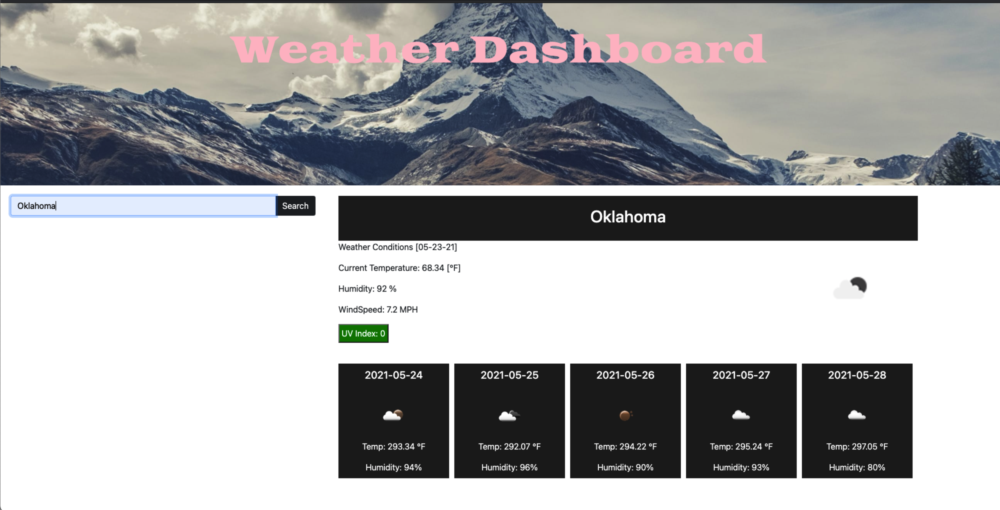

# Weather-Dashboard

## Description
This project goal was to create a Weather Dashboard retrieving data from another application API, were the user can see the weather outlook of an specific city and it is presented with future conditions.

## Table of Contents
- [Installation](#Installation)
- [Usage](#Usage) 
- [Contributing](#Contributing)
- [License](#License)
- [Test](#Test)
- [Questions](#Questions)

##  Installation
Clone this repository and have fun

##  Usage
By entering the name of a city, a Daily Forecast will be displayed on the app as well as a 5 Day Forecast.

##  Contributing
Contributions are welcomed

##  License
MIT

## Test
Feel free to test the application and share feedback.

## Questions
Please feel free to reach me with additional questions: lismeyplasencia@gmail.com
GitHub profile: Lismey23

## GitHub Repo
<a href="https://github.com/Lismey23/weather-dashboard">GitHub Repo</a>

## Deployed Application
<a href="https://lismey23.github.io/weather-dashboard/">Deployed Application</a>